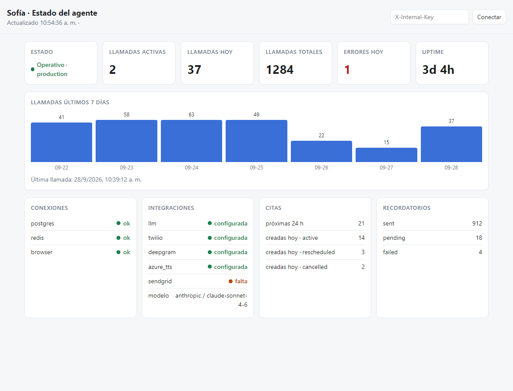

# SofiaAgent

Agente de voz para agendar, reprogramar y cancelar citas médicas por teléfono.
FastAPI + Twilio Media Streams (llamada), Deepgram (STT), Azure Neural TTS (voz),
Claude (razonamiento), PostgreSQL (citas) y Redis (sesiones y métricas).

## Arranque

```bash
cp .env.example .env        # rellenar claves; nunca versionar .env
docker compose up -d --build
curl http://localhost:8000/health/ready
```

`docker compose` levanta Postgres, Redis, ejecuta las migraciones y arranca la API
en el puerto 8000.

## Dashboard operativo



<sub>Captura con datos de ejemplo. Versión oscura: [docs/dashboard-dark.png](docs/dashboard-dark.png).</sub>

Muestra en tiempo real (refresco cada 5 s):

- **Estado general**: operativo / degradado, entorno y uptime.
- **Llamadas**: activas, hoy, totales, errores del día y barras de los últimos 7 días.
- **Conexiones**: Postgres, Redis y Chromium (form filler).
- **Integraciones**: LLM, Twilio, Deepgram, Azure TTS y SendGrid (configurada / falta).
- **Citas y recordatorios**: creadas hoy por estado, próximas 24 h y recordatorios por estado.

Sólo expone conteos y estados: ningún dato de pacientes ni secretos.

### Cómo abrirlo

1. Definir al menos una clave en `INTERNAL_API_KEYS` del `.env`
   (la misma que usa el cron de recordatorios):
   ```bash
   INTERNAL_API_KEYS=["<clave-larga-aleatoria>"]
   ```
2. Arrancar el stack (`docker compose up -d --build`). La imagen compila el
   frontend TypeScript en una etapa de Node; no hace falta Node en el host.
3. Abrir <http://localhost:8000/dashboard> e introducir la clave.

La página no contiene datos; los pide a `GET /dashboard/data` con la cabecera
`X-Internal-Key`. Sin clave válida responde 401.

### Desarrollo local (sin Docker)

```bash
cd dashboard
npm ci
npm run build     # genera app/api/static/dashboard.js
npm run watch     # recompila al guardar
```

El código fuente está en `dashboard/src/dashboard.ts`; sus tipos reflejan el JSON
de `/dashboard/data` (`app/api/dashboard.py`). El `.js` compilado no se versiona.

## Tests

Cada test es un script que se ejecuta directo:

```bash
for t in tests/test_*.py; do python "$t"; done
```
